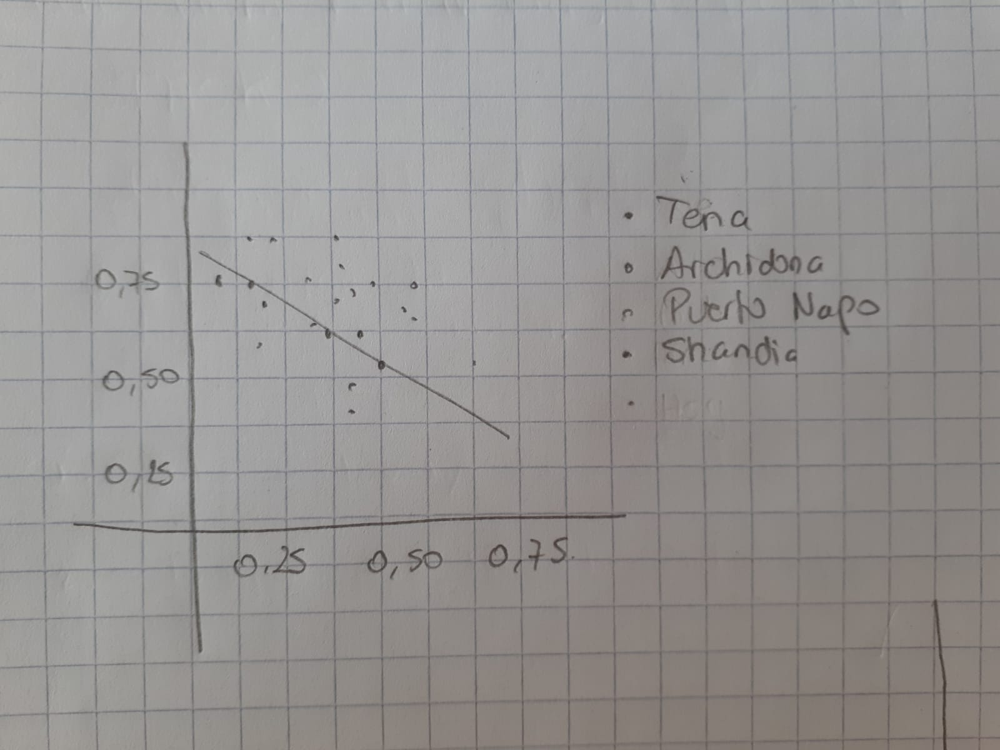

<center></center>


Bienvenidos al examen parcial de Métodos Cuantitativos en Ecología [MCE5 - 2023I]. Para esta evaluación utilice este cuaderno de R Markdown y tenga en cuenta las siguientes instruciones:

* **FUNDAMENTAL: La entrega es el enlace de GitHub.** A partir de una bifurcación de la carpeta del examen de GitHub, cree una carpeta en su computador donde guarden este cuaderno .Rmd y la data que van a utilizar. Definan a esa carpeta como su directorio de trabajo. 

* Arriba, donde dice "author", deben cambiar por sus datos.

* Los codigos deben ser escritos dentro de las cajas ```{r} ``` o dentro de las cajas indicadas abajo de las preguntas.

* Genere un documento html de este cuaderno .Rmd. 

* Guarde todos los documentos y figuras en una carpeta "mce5_exame1", copie y pegue el enlace en el aula virtual, donde dice "ExamenParcial1".

* **FUNDAMENTAL: No imprima tablas completas, si quiere mostrar algo use la función ```head()```.**

* **FUNDAMENTAL: Todo bloque de código (30%) debe ir acompañado de una explicación del resultado (70%). Si no tiene la explicación no será considerado para calificar.**  

* **FUNDAMENTAL: La honestidad académica es fundamental en su formación, escriba ideas propias, evite el plagio y la copia que incluye el uso indebido de herramientas de inteligencia artificial.**


# **[2 PUNTOS] Control de cambios.**

* Realice la bifurcación de la carpeta del Examen

* Cree una carpeta en su conputador con "Control de Cambios" usando Git

* Cada vez que responda una pregunta, envíe los cambios con un ```commit``` similar a `Apellido Nombre ha realizado el ejercicio ##`. 

# **[2 PUNTOS] Diseño, especies raras.**

En el estudio realizado por <a href="https://doi.org/10.1111/jvs.13185">Sanches -Martin R., Verdú M. y Montensinos-Navarro A. (2023)</a> evaluan cómo la facilitación interespecífica puede mantener la diversidad a lo largo de la vida de la especie al evitar la extinción de especies localmente raras en etapas juveniles y reducir las disparidades de rendimiento entre vecinos de diferentes especies en etapas maduras.. Suponga que quiere replicar este estudio en alguna zona del Ecuador. Para ello inicie respondiendo las siguientes preguntas:  

## Para su potencial investigación ¿Cuál sería su hipótesis ? (Explique)

**Respuesta:**

Hipotesis 0(nula): La "facilitación" no tiene ningun efecto en el equilibrio de especies cuando crecen en grupo o parches.

Hipotesis 1(alterna): La "facilitación" ayuda a equelibrar el crecimiento de todas las especies cuando crecen en grupo o en parches.

En el artículo menciona que existen plantas en etapas maduras y otras en etapas  jovenes que muchas veces el crecimiento de plantas maduras no permite el crecimiento de plantas jovenes. la facilitación es la encargada de controlar el crecimiento excesivo y proteger a las especies que son diferentes o unicas. Ademas de ser causante de ser la adaptación de suelos.

## Muestra

Replique el diseño realizado en el artículo en localidades del Ecuador y genere el archivo **rarespecies.csv**. 

```{r crd_anfibios}
sitios = c("Tena", "Archidona", "Puerto Napo", "Shandia")

```
Explique el resultado muestra: 

**Respuesta:**

Los lugares escogidos deben tener una ubicación en el Ecuador y no sobre pasar el límite de 20km. Para escoger los sitios tome de punto central a Tena para así avanzar por a los demás lugares ya indicados.


## Variables
¿Cuáles son sus variables (dependiente(s) e independiente(s))? Explique cada una de las variables

**Respuesta:**

Variable dependiente: Ecosistema, Facilitador 

Variable independiente: Plantas, Clima, Calidad del suelo

El ecosistema de las plantas y el facilitador son variables dependientes porque estos son parte de la naturaleza y siguen un proceso natural. En cambio las plantas tienen temporadas que abundan más y otras que no germian sea por condición de clima u condición de suelo.

## Gráfica e hipótesis
En una hoja de papel dibuje un gráfico hipotetico basado en la figura 4 del artículo mostrando [Coloque adecuadamente las leyendas]. Describa su figura justifique su razonamiento.

**Respuesta (adjunte una foto de la imagen o genere una gráfica con código)**
<center></center>


# **[6 PUNTOS] Regresiones

En esta parte debe aplicar las regresiones lineal, linearizada y generalizada sobre la presencia de ácaros en musgos. Una de las especies analizadas es *Galumma sp.* cuya abundancia presencia y proporción es posiblemente afectada por las siguiente cinco variables ambientales como densidad de sustrato, el tipo de sustrato, el contenido de agua, si se tiene o no arbustos en la cercanía y la topografía del suelo. Utilice la data ```mites.csv``` y responda los siguientes items. 

```{r}
library(readr)
mites <- read_csv("mites.csv")
View(mites)
```

- ¿Cuál es el efecto de las variables ambientales en la i) abundancia de ii) abundancia y iii) proporción de la especie *Galumma sp.*?

Para responder esta pregunta debe generar las hipótesis y probar las hipótesis (código y explicación), asimismo visualizar con etiquetas adecuadas. Considere realizar lo siguiente:

- Realizar un análisis exploratorio.

```{r}
head(mites)
```

- Realizar regresiones lineales de cada variable de respuesta y variables efectoras, univariable o multivariable. Verifique los supuestos de la regresión. 

- Realizar regresiones linearizadas de cada variable de respuesta y variables efectoras, univariable o multivariable. 

- Realizar regresiones lineales generalizadas de cada variable de respuesta y variables efectoras, univariable o multivariable. 

- Comparar de la bondad de las regresiones. 
